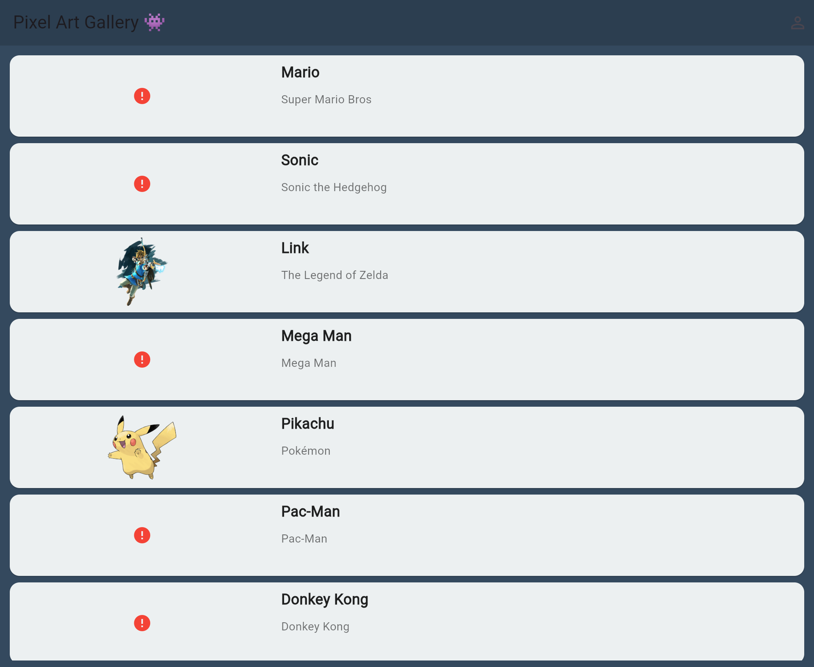

# Pixel Art (Flutter)

A small **Flutter** app — a *Pixel Art Gallery* of classic video-game characters (Mario, Sonic, Link, Pikachu, and more) that you can browse, open for details, and an about page.

<p align="center">
  
</p>

> Character artwork is loaded from external image URLs; a few of those links no longer resolve and show a placeholder icon.

## Screens

- **Main** (`lib/main_screen.dart`) — a grid/list of pixel-art characters.
- **Detail** (`lib/detail_screen.dart`) — a single character with its description.
- **About** (`lib/about_screen.dart`) — info about the app.

Character data is modelled in [`lib/model/pixel_character.dart`](lib/model/pixel_character.dart).

## Run it

```bash
flutter pub get
flutter run        # on a device/emulator
# or, for the browser:
flutter run -d chrome
```

## Tech stack

Flutter · Dart · Material Design

## Notes

Submission for Dicoding's Flutter track. The project targets Android, iOS, web, and desktop (default Flutter platforms).
