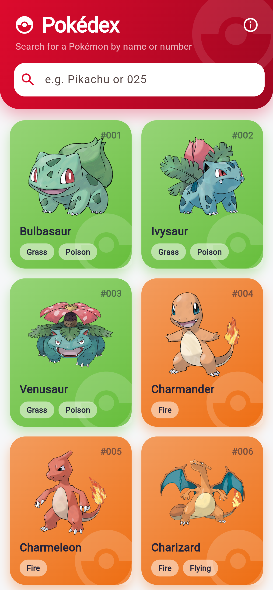
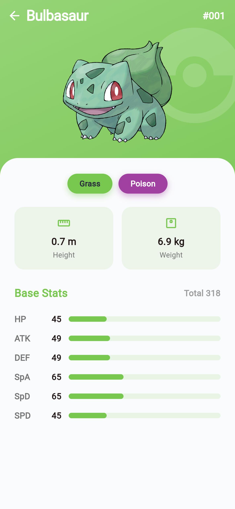

# Flutter Pokédex

A Pokédex built with **Flutter**, powered live by the free [PokéAPI](https://pokeapi.co) — browse Pokémon in a grid, then tap any one for its types and base stats.

**🔗 Live demo → [flutter-pokedex-six.vercel.app](https://flutter-pokedex-six.vercel.app)**

<p align="center">
  
  &nbsp;&nbsp;&nbsp;
  
</p>

## Features

- **Live data** from the PokéAPI — official artwork, types, height/weight, and base stats.
- **Search** by name or Dex number, filtering the grid as you type.
- **Grid gallery** of type-coloured cards, each with its National Dex number.
- **Detail view** with a type-coloured header, type chips, height/weight tiles, and animated base-stat bars.
- Graceful **loading and error states**, with retry on failure.

## How it's built

- `lib/models/` — `PokemonSummary` and `PokemonDetail` data classes.
- `lib/services/pokemon_service.dart` — a small typed client over the PokéAPI.
- `lib/utils/type_colors.dart` — the canonical Pokémon type colours.
- `lib/main_screen.dart` (grid) and `lib/detail_screen.dart` (details).

## Run it

```bash
flutter pub get
flutter run -d chrome   # or any device / emulator
```

## Tech stack

Flutter · Dart · http · PokéAPI · Material 3
